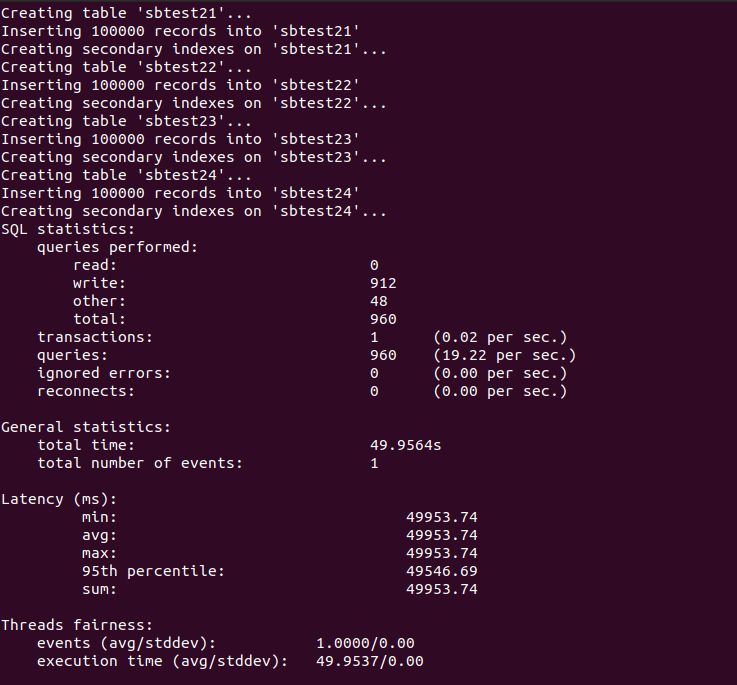
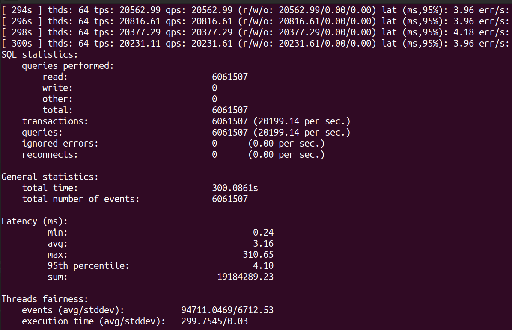

# Load tests (tested on Debian/Ubuntu)

## 1. Install sysbench
> $ curl -s https://packagecloud.io/install/repositories/akopytov/sysbench/script.deb.sh | sudo bash

> $ sudo apt -y install sysbench

## 2. Create the database and user inside PostgreSQL
>$ psql
>> CREATE USER sbtest WITH PASSWORD 'password';

>> CREATE DATABASE sbtest;

>> GRANT ALL PRIVILEGES ON DATABASE sbtest TO sbtest;

## 3. Run test_1.sh for table and rows creation.

## 4. Run multi-thread stress test with SELECT-queries

